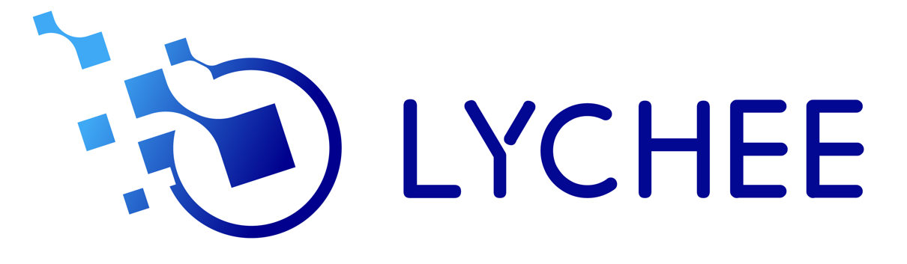

<div align="center">
  
  <h1>LycheeMem</h1>
  <p>
    
    
    
    
  </p>
  <p>
    <a href="README_zh.md">中文</a> | English
  </p>
</div>


LycheeMem is a cognitive memory system for long-horizon AI agents, providing persistent, structured, and temporally-aware memory. It models memory the way humans use it — distinguishing what you remember *happening* from what you have come to *know* — and makes those memories available at inference time through a multi-stage reasoning pipeline.

---

<div align="center">
  <a href="#news">News</a>
  •
  <a href="#memory-architecture">Memory Architecture</a>
  •
  <a href="#pipeline">Pipeline</a>
  •
  <a href="#quick-start">Quick Start</a>
  •
  <a href="#web-demo">Web Demo</a>
  •
  <a href="#openclaw-plugin">OpenClaw Plugin</a>
  •
  <a href="#mcp">MCP</a>
  •
  <a href="#api-reference">API Reference</a>
</div>

---

<a id="news"></a>

## 🔥 News

- [03/28/2026] Semantic memory has been upgraded to Compact Semantic Memory (SQLite + LanceDB), no Neo4j required. See [/quick-start](#quick-start) for details.
- [03/27/2026] OpenClaw Plugin is now available at [/openclaw-plugin](#openclaw-plugin) ! [Setup guide →](openclaw-plugin/INSTALL_OPENCLAW.md)
- [03/26/2026] MCP support is available at [/mcp](#mcp) !
- [03/23/2026] LycheeMem is now open source: [GitHub Repository →](https://github.com/LycheeMem/LycheeMem)

---

<a id="memory-architecture"></a>

## 📚 Memory Architecture

LycheeMem organizes memory into three complementary stores:

<table>
  <thead>
    <tr>
      <th>Working Memory</th>
      <th>Semantic Memory</th>
      <th>Procedural Memory</th>
    </tr>
  </thead>
  <tbody>
    <tr>
      <td>
        <p>(Episodic)</p>
        <ul>
          <li>Session turns</li>
          <li>Summaries</li>
          <li>Token budget management</li>
        </ul>
      </td>
      <td>
        <p>(Compact Action-Aware Store)</p>
        <ul>
          <li>7 MemoryUnit types</li>
          <li>Online Pragmatic Synthesis</li>
          <li>Action-Aware Retrieval Planning</li>
          <li>RL-ready usage statistics</li>
        </ul>
      </td>
      <td>
        <p>(Skills)</p>
        <ul>
          <li>Skill entries</li>
          <li>HyDE retrieval</li>
        </ul>
      </td>
    </tr>
  </tbody>
</table>

### 💾 Working Memory

The working memory window holds the active conversation context for a session. It operates under a **dual-threshold token budget**:

- **Warn threshold (70%)** — triggers asynchronous background pre-compression; the current request is not blocked.
- **Block threshold (90%)** — the pipeline pauses and flushes older turns to a compressed summary before proceeding.

Compression produces *summary anchors* (past context, distilled) + *raw recent turns* (last N turns, verbatim). Both are passed downstream as the conversation history.

### 🗺️ Semantic Memory — Compact Semantic Memory

Semantic memory uses an **action-aware compact encoding** scheme. The storage layer is SQLite (FTS5 full-text search) + LanceDB (vector index).

#### Memory Unit Types

Each memory entry is stored as a `MemoryUnit`. The `memory_type` field distinguishes seven semantic categories:

| Type | Description |
|------|-------------|
| `fact` | Objective facts about the user, environment, or world |
| `preference` | User preferences (style, habits, likes/dislikes) |
| `event` | Specific events that have occurred |
| `constraint` | Conditions that must be respected |
| `procedure` | Reusable step-by-step procedures / methods |
| `failure_pattern` | Previously failed action paths and their causes |
| `tool_affordance` | Capabilities and applicable scenarios of tools/APIs |

Beyond text, every `MemoryUnit` carries **action-facing metadata** (`tool_tags`, `constraint_tags`, `failure_tags`, `affordance_tags`) and **usage statistics** (`retrieval_count`, `action_success_count`, etc.) to seed future reinforcement-learning signals.

Related `MemoryUnit`s can be merged online by the **Pragmatic Synthesizer** into a denser `SynthesizedUnit`; synthesized entries are ranked above source fragments during retrieval.

#### Four-Module Pipeline

##### Module 1: Compact Semantic Encoding

A three-stage sequential pipeline that converts conversation turns into a list of `MemoryUnit`s:

1. **Atomic extraction** — LLM extracts minimal self-contained facts; each memory entry stands alone as a complete sentence.
2. **Decontextualization** — Pronouns and context-dependent phrases are expanded into full expressions, so each unit is understandable without the original dialogue.
3. **Action metadata annotation** — LLM annotates each unit with `memory_type`, `tool_tags`, `constraint_tags`, `failure_tags`, `affordance_tags`, and other structured labels.

`unit_id = SHA256(normalized_text)` — naturally idempotent; duplicate content is deduplicated automatically.

##### Module 2: Pragmatic Memory Synthesis

Triggered online after each consolidation:

1. FTS detects existing entries whose text is similar to the new units (candidate pool).
2. LLM judges whether the candidate pool is worth merging (`synthesis_judge`).
3. If yes, LLM executes the merge and produces a `SynthesizedUnit` written to both SQLite and LanceDB; original units are retained.

##### Module 3: Action-Aware Retrieval Planning

Before retrieval, `ActionAwareRetrievalPlanner` analyses the user query and emits a `RetrievalPlan`:

- `mode`: `answer` (factual Q&A) / `action` (needs execution) / `mixed`
- `semantic_queries`: content-facing search terms
- `pragmatic_queries`: action/tool/constraint-facing search terms
- `tool_hints`: tools likely needed for this request
- `required_constraints`: constraints that are missing
- `missing_slots`: parameters / slots that are absent

The plan drives five-channel recall -> Scorer ranking:

1. **FTS channel** — SQLite FTS5 keyword recall over `MemoryUnit` + `SynthesizedUnit`
2. **Semantic vector channel** — LanceDB ANN over `semantic_text` embeddings
3. **Normalised vector channel** — LanceDB ANN over `normalized_text` embeddings (for pragmatic queries)
4. **Tag filter channel** — exact filter by `tool_hints` / `constraint_tags`
5. **Temporal channel** — filter by `RetrievalPlan.temporal_filter` time window

Scorer combines all signals using the formula:

$$\text{Score} = \alpha \cdot S_\text{sem} + \beta \cdot S_\text{action} + \gamma \cdot S_\text{temporal} + \delta \cdot S_\text{recency} + \eta \cdot S_\text{evidence} - \lambda \cdot C_\text{token}$$

| Weight | Meaning | Default |
|--------|---------|---------|
| α | SemanticRelevance (vector distance -> similarity) | 0.30 |
| β | ActionUtility (tag match score, mode-aware) | 0.25 |
| γ | TemporalFit (temporal reference match) | 0.15 |
| δ | Recency (memory freshness) | 0.10 |
| η | EvidenceDensity (evidence span density) | 0.10 |
| λ | TokenCost penalty (text length penalty) | 0.10 |

### 🛠️ Procedural Memory — Skill Store

The skill store preserves reusable *how-to* knowledge as structured skill entries, each carrying:

- **Intent** — a short description of what the skill does.
- **`doc_markdown`** — a full Markdown document describing the procedure, commands, parameters, and caveats.
- **Embedding** — a dense vector of the intent text, used for similarity search.
- **Metadata** — usage counters, last-used timestamp, preconditions.

Skill retrieval uses **HyDE (Hypothetical Document Embeddings)**: the query is first expanded into a *hypothetical ideal answer* by the LLM, then that draft text is embedded to produce a query vector that matches well against stored procedure descriptions, even when the user's original phrasing is vague.

---

<a id="pipeline"></a>

## ⚙️ Pipeline

Every request passes through a fixed sequence of five agents. Four are synchronous stages in the LangGraph pipeline; one is a background post-processing task.

<div align="center">
  <div>
    <div>START</div>
    <div>▼</div>
    <div>
      <div>
        <div>
          <strong>1. WMManager</strong> — Token budget check + compress/render
        </div>
        <div>↓</div>
        <div>
          <strong>2. SearchCoordinator</strong> — Planner → Semantic + Skill retrieval
        </div>
        <div>↓</div>
        <div>
          <strong>3. SynthesizerAgent</strong> — LLM-as-Judge scoring + context fusion
        </div>
        <div>↓</div>
        <div>
          <strong>4. ReasoningAgent</strong> — Final response generation
        </div>
      </div>
    </div>
    <div>▼</div>
    <div>END</div>
    <div>
      <span>Background</span>
      <span>asyncio.create_task( <strong>ConsolidatorAgent</strong> )</span>
    </div>
  </div>
</div>

### Stage 1 — WMManager

Rule-based agent (no LLM prompt). Appends the user turn to the session log, counts tokens, and fires compression if either threshold is crossed. Produces `compressed_history` and `raw_recent_turns` for downstream stages.

### Stage 2 — SearchCoordinator

`ActionAwareRetrievalPlanner` first analyses the user query and produces a `RetrievalPlan` containing `mode`, `semantic_queries`, `pragmatic_queries`, `tool_hints`, and more. Five parallel recall channels (FTS full-text, semantic vector, normalised vector, tag filter, temporal filter) then query SQLite + LanceDB, and the resulting candidates are ranked by the six-dimensional Scorer formula before being merged into `background_context`. Skill sub-queries use HyDE embedding against the skill store.

### Stage 3 — SynthesizerAgent

Acts as an **LLM-as-Judge**: scores every retrieved memory fragment on an absolute 0-1 relevance scale, discards fragments below the threshold (default 0.6), and fuses the survivors into a single dense `background_context` string. It also identifies `skill_reuse_plan` entries that can directly guide the final response. This stage outputs `provenance` — a citation list containing scoring breakdown and source references for each kept memory item.

### Stage 4 — ReasoningAgent

Receives `compressed_history`, `background_context`, and `skill_reuse_plan` and generates the final assistant reply. It appends the assistant turn back to the session store, completing the feedback loop.

### Background — ConsolidatorAgent

Triggered immediately after `ReasoningAgent` completes, runs in a thread pool and **does not block the response**. It:

1. Performs a **novelty check** — LLM judges whether the conversation introduced new information worth persisting. Skips consolidation for pure retrieval exchanges.
2. **Compact consolidation** — calls `CompactSemanticEngine.ingest_conversation()`, which runs the three-stage encoder (atomic extraction → decontextualization → action metadata annotation), writes `MemoryUnit`s to SQLite + LanceDB, then triggers online Pragmatic Synthesis to merge similar entries into `SynthesizedUnit`s.
3. **Skill extraction** — identifies successful tool-usage patterns in the conversation and adds skill entries to the skill store. Runs in parallel with compact consolidation (ThreadPoolExecutor).

---

<a id="quick-start"></a>

## ⚡ Quick Start

### Prerequisites

- Python 3.11+
- An LLM API key (OpenAI, Gemini, or any litellm-compatible provider)

### Installation

```bash
git clone https://github.com/LycheeMem/LycheeMem.git
cd LycheeMem
pip install -e ".[dev]"
```

### Configuration

Copy `.env.example` to `.env` and fill in your values:

```dotenv
# LLM — litellm format: provider/model
LLM_MODEL=openai/gpt-4o-mini
LLM_API_KEY=sk-...
LLM_API_BASE=                     # optional

# Embedder
EMBEDDING_MODEL=openai/text-embedding-3-small
EMBEDDING_DIM=1536

# Semantic memory storage paths (optional, defaults to data/ directory)
COMPACT_MEMORY_DB_PATH=data/compact_memory.db
COMPACT_VECTOR_DB_PATH=data/compact_vector
```

> **Supported LLM providers** (via [litellm](https://github.com/BerriAI/litellm)):  
> `openai/gpt-4o-mini` · `gemini/gemini-3.0-flash` · `ollama_chat/qwen2.5` · any OpenAI-compatible endpoint

### Start the Server

```bash
python main.py
# with hot-reload:
python main.py --reload
```

The API is served at `http://localhost:8000`. Interactive docs at `/docs`.

---

<a id="web-demo"></a>

## 🎨 Web Demo

A frontend demo is included under `web-demo/`. It provides a chat interface alongside live views of semantic memory, skill library, and working memory state.

```bash
cd web-demo
npm install
npm run dev      # served at http://localhost:5173
```

> Make sure the backend is running on port 8000 (or update proxy settings in `web-demo/vite.config.ts`) before starting the frontend.

---

<a id="openclaw-plugin"></a>

## 🦞 OpenClaw Plugin

LycheeMem ships a native [OpenClaw](https://openclaw.ai) plugin that gives any OpenClaw session persistent long-term memory with zero manual wiring.

**What the plugin provides:**

- `lychee_memory_smart_search` — default long-term memory retrieval entry point
- **Automatic turn mirroring** via hooks — the model does **not** need to call `append_turn` manually
  - User messages are appended automatically
  - Assistant messages are appended automatically
- `/new`, `/reset`, `/stop`, and `session_end` automatically trigger boundary consolidation
- Proactive consolidation on strong long-term knowledge signals

**Under normal operation:**
- The model only calls `lychee_memory_smart_search` when recalling long-term context
- The model may call `lychee_memory_consolidate` manually when an immediate persist is warranted
- The model does **not** need to call `lychee_memory_append_turn` at all

### Quick Install

```bash
openclaw plugins install "/path/to/LycheeMem/openclaw-plugin"
openclaw gateway restart
```

See the full setup guide: [openclaw-plugin/INSTALL_OPENCLAW.md](openclaw-plugin/INSTALL_OPENCLAW.md)

---

<a id="mcp"></a>

## 🔧 MCP

LycheeMem also exposes an HTTP MCP endpoint at `http://localhost:8000/mcp`.

- Available tools: `lychee_memory_search`, `lychee_memory_synthesize`, `lychee_memory_consolidate`
- Use `Authorization: Bearer <token>` if you want per-user memory isolation
- `lychee_memory_consolidate` only works for sessions that were already written through `/chat` or `/memory/reason`

### MCP Transport

- `POST /mcp` handles JSON-RPC requests
- `GET /mcp` exposes the SSE stream used by some MCP clients
- The server returns `Mcp-Session-Id` during `initialize`; reuse that header on later requests

### Authentication

If you want isolated memory per user, first obtain a JWT token from `/auth/register` or `/auth/login`, then send:

```text
Authorization: Bearer <token>
```

Without a token, requests run with an empty `user_id`, so anonymous traffic shares the same namespace.

### Client Configuration

For any MCP client that supports remote HTTP servers, configure the MCP URL as:

```text
http://localhost:8000/mcp
```

Generic config example:

```json
{
  "mcpServers": {
    "lycheemem": {
      "url": "http://localhost:8000/mcp",
      "headers": {
        "Authorization": "Bearer <token>"
      }
    }
  }
}
```

### Manual JSON-RPC Flow

1. Call `initialize`
2. Reuse the returned `Mcp-Session-Id`
3. Send `initialized`
4. Call `tools/list`
5. Call `tools/call`

Initialize example:

```bash
curl -i -X POST http://localhost:8000/mcp \
  -H "Content-Type: application/json" \
  -H "Authorization: Bearer <token>" \
  -d '{
    "jsonrpc": "2.0",
    "id": 1,
    "method": "initialize",
    "params": {
      "protocolVersion": "2025-03-26",
      "capabilities": {},
      "clientInfo": {
        "name": "debug-client",
        "version": "0.1.0"
      }
    }
  }'
```

Tool call example:

```bash
curl -X POST http://localhost:8000/mcp \
  -H "Content-Type: application/json" \
  -H "Authorization: Bearer <token>" \
  -H "Mcp-Session-Id: <session-id>" \
  -d '{
    "jsonrpc": "2.0",
    "id": 2,
    "method": "tools/call",
    "params": {
      "name": "lychee_memory_search",
      "arguments": {
        "query": "what tools do I use for database backups",
        "top_k": 5,
        "include_graph": true,
        "include_skills": true
      }
    }
  }'
```

### Recommended MCP Usage Pattern

1. Use `/chat` or `/memory/reason` with a stable `session_id` to write conversation turns.
2. Use `lychee_memory_search` to retrieve relevant long-term memory.
3. Use `lychee_memory_synthesize` to compress retrieval results into `background_context`.
4. After the conversation ends, call `lychee_memory_consolidate` with the same `session_id`.

---

<a id="api-reference"></a>

## 🔌 API Reference

### `POST /memory/search` — Unified Memory Retrieval

Query both the semantic memory channel and the skill store in a single call.

```json
// Request
{
  "query": "what tools do I use for database backups",
  "top_k": 5,
  "include_graph": true,
  "include_skills": true
}

// Response
{
  "query": "...",
  "graph_results": [
    {
      "anchor": {
        "node_id": "compact_context",
        "name": "CompactSemanticMemory",
        "label": "Context",
        "score": 1.0
      },
      "constructed_context": "...",
      "provenance": [ { "id": "...", "source": "semantic_memory", "relevance": 0.91, ... } ]
    }
  ],
  "skill_results": [ { "id": "...", "intent": "pg_dump backup to S3", "score": 0.87, ... } ],
  "total": 6
}
```

---

### `POST /memory/synthesize` — Memory Fusion

Takes raw retrieval results and produces a fused memory context using LLM-as-Judge.

```json
// Request
{
  "user_query": "what tools do I use for database backups",
  "graph_results": [...],   // from /memory/search
  "skill_results": [...]
}

// Response
{
  "background_context": "User regularly uses pg_dump with a cron job...",
  "skill_reuse_plan": [ { "skill_id": "...", "intent": "...", "doc_markdown": "..." } ],
  "provenance": [ { "id": "...", "source": "semantic_memory", "relevance": 0.91, ... } ],
  "kept_count": 4,
  "dropped_count": 2
}
```

---

### `POST /memory/reason` — Grounded Reasoning

Runs the ReasoningAgent given pre-synthesized context. Can be chained after `/memory/synthesize` for full pipeline control.

```json
// Request
{
  "session_id": "my-session",
  "user_query": "what tools do I use for database backups",
  "background_context": "User regularly uses pg_dump...",
  "skill_reuse_plan": [...],
  "append_to_session": true   // write result to session history (default: true)
}

// Response
{
  "final_response": "You typically use pg_dump scheduled via cron...",
  "session_id": "my-session",
  "wm_token_usage": 3412
}
```

---

### `POST /memory/consolidate/{session_id}` — Trigger Consolidation

Manually trigger memory consolidation for a session (normally runs automatically in the background after each chat turn).

```bash
curl -X POST http://localhost:8000/memory/consolidate/my-session
```

```json
// Response
{ "message": "Consolidation done: 5 entities, 2 skills extracted." }
```

### Usage Examples

```bash
# Basic single-turn demo (automatically registers 'demo_user')
python examples/api_pipeline_demo.py

# Multi-turn chat demo (3 consecutive turns, followed by consolidation)
python examples/api_pipeline_demo.py --multi-turn

# Custom query and user credentials
python examples/api_pipeline_demo.py --username alice --password secret123 \
  --query "How do I backup my database with pg_dump?"

# Use a fixed session_id (useful for accumulating history across multiple runs)
python examples/api_pipeline_demo.py --session-id my-test-session
```
